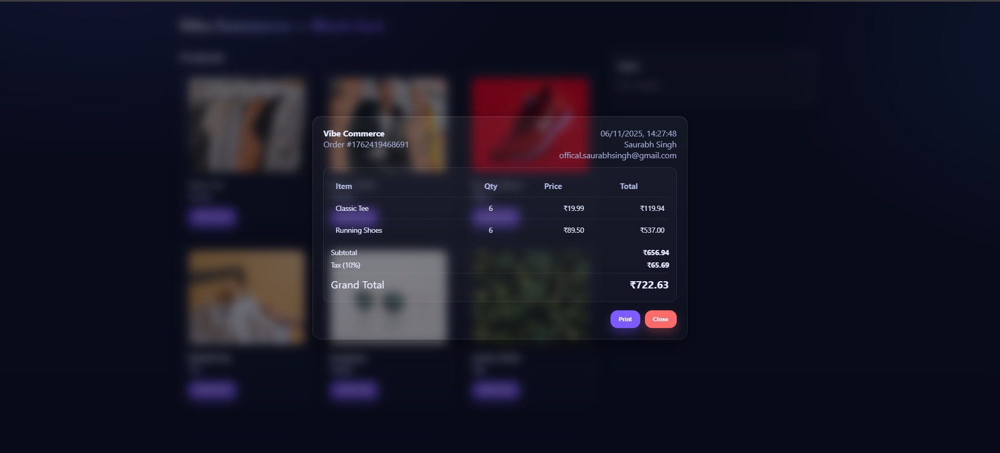
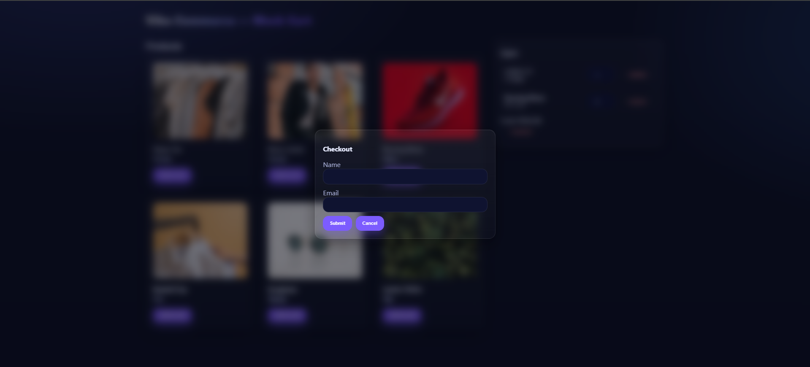
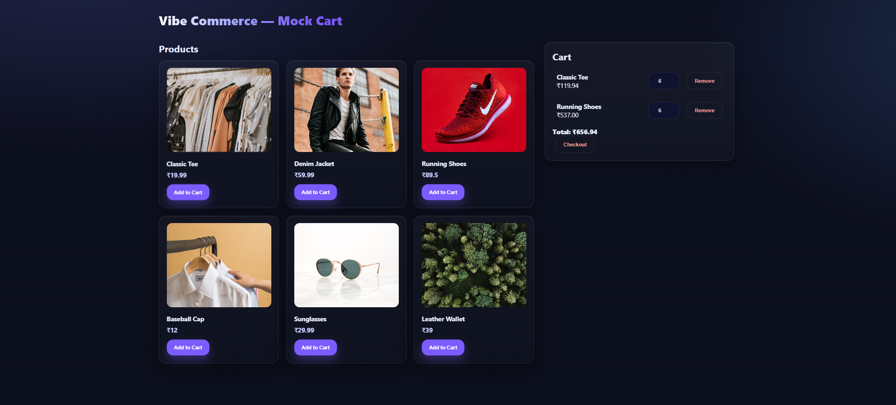
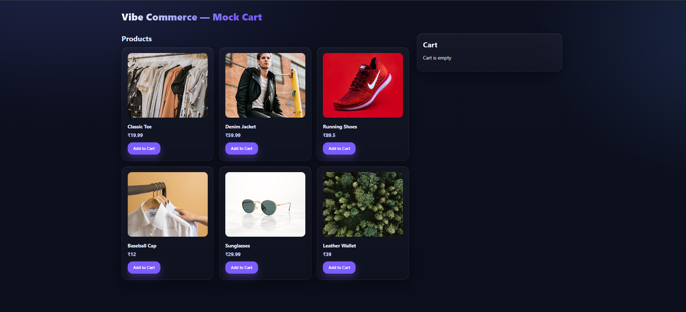

# Mock E‑Com Cart — Complete (MongoDB edition)

This repo contains a minimal full-stack shopping cart app that satisfies the assignment:
- Backend: Node/Express + MongoDB (Mongoose)
- Frontend: React + Vite
- Features implemented: product listing, add/remove cart items, update qty, cart total, mock checkout (receipt + timestamp), DB persistence (MongoDB), error handling, basic responsive UI.

## Run locally (summary)
1. Backend: cd backend && npm install && copy .env.example to .env and fill MONGO_URI && npm run seed && npm run dev
2. Frontend: cd frontend && npm install && npm run dev

Open http://localhost:5173 and test the flows.

## 🖼️ Screenshot

